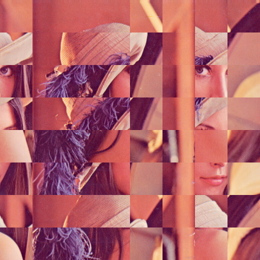
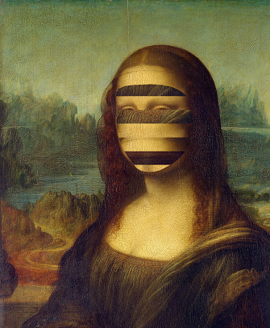

# Scramblery

A simple tool to scramble your images or only faces from images or videos

details: 

https://altunenes.github.io/scramblery/

Online demo in javascript: 

https://altunenes.github.io/scramblery/scramblerydemo.html

#### Purpose of Package
 The purpose of this package is the creating scrambled images from images or videos. User can either scramble the whole image or only facial area.
 This is very useful tool in psychology experiments especially if you are working with faces.

#### **Features**
- Scramble whole image with desired degree of scrambling
- Scramble only facial area with desired degree of scrambling
- Scramble only facial area in a video (useful for dynmaic stimuli) with desired degree of scrambling

#### Installation
- The package can be found in pypi. To install the package, run the following command in the terminal:
- `pip install scramblery`
#### Usage
- import the package:
- `from scramblery import scramblery`
- `scramblery.scrambleimage("Lena.png",8,8)`
- 

- `scramblery.scrambleface("Mona.png",8)
- 
`
#### Author
  -  Main Maintainer: [Enes ALTUN]

### Contributon
 Any kind of contribution is welcome. Thanks.
