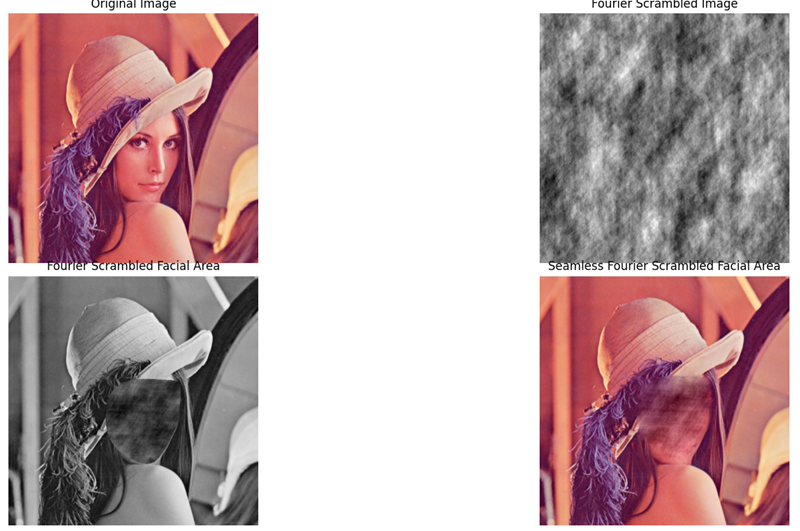

 # Scramblery
[](https://pepy.tech/project/scramblery)
[](https://badge.fury.io/py/scramblery)
[](https://github.com/altunenes/scramblery/actions/workflows/jekyll.yml)
[](https://ci.appveyor.com/project/altunenes/scramblery)
[](https://zenodo.org/badge/latestdoi/449034134)


A simple tool to scramble your images or only faces from images or videos. You can find the online demo in javascript [here](https://altunenes.github.io/scramblery/scramblerydemo.html). For more information, please visit the [documentation](https://altunenes.github.io/scramblery/).

Note: The Javascript demo doesn't have a face detection algorithm and it's designed to be applied to a single image. If you want to do this for multiple imagees you should use Python.

Citation

`Altun, E. (2023). altunenes/scramblery: 1.2.5 (1.2.5). Zenodo. https://doi.org/10.5281/zenodo.10028991`

### Purpose of Package
The Scramblery package offers tools for creating scrambled images from existing images or videos. Users have the flexibility to scramble entire images or target only specific areas, such as faces. This functionality is particularly beneficial in psychological experiments involving facial recognition tasks. With Scramblery, users can automate the scrambling of multiple images, eliminating the tedious manual process traditionally associated with this task. We hope this package significantly contributes to your research endeavors.

### Motivation

- Image scrambling plays a crucial role in psychology experiments, enabling researchers to manipulate visual stimuli while maintaining control over certain visual aspects. This manipulation helps eliminate or alter specific features or patterns that may influence participants' perceptions or responses.

- Scramblery allows for the creation of stimuli that retain general attributes such as luminance, contrast, and spatial layout, but lack identifiable features or objects. This is useful in experiments where researchers wish to control for these specific attributes.

- The package helps in mitigating biases and confounding variables in stimuli, thereby providing more reliable and valid experimental conditions. The ability to automate this process ensures consistency across stimuli and saves valuable time for researchers.

### Features

- Scramble an entire image with a specified degree of scrambling (either by altering pixel values or pixel coordinates).
- Target scrambling to only the facial area within an image, with customizable levels of scrambling.
- Extend the scrambling feature to videos, particularly useful for dynamic stimuli in motion-based experiments.
- Leverage Fourier-based scrambling to disrupt the phase information while maintaining the power spectrum, particularly useful for psychophysical studies.

### Installation

Scramblery is available on PyPI and can be installed using pip. Use the following command in your terminal:

#### Installation
- The package can be found in pypi. To install the package, run the following command in the terminal:
- `pip install scramblery`


- `from scramblery import scramblery`
Then use the functions as follows to scramble images. I added some examples below.

  

  
  


### Usage

After installation, you can import and use Scramblery as follows:

```python
from scramblery import scramblery

# To scramble an entire image
scramblery.scrambleimage("Lena.png", x_block=10, y_block=10, scramble_type='classic', seed=None, write=True)

# To scramble only the facial area within an image
scramblery.scrambleface("Lena.png", splits=10, type='pixel', seamless=False, bg=True, seed=None, write=True)

# To apply Fourier-based scrambling on an image
scramblery.scrambleimage("Lena.png", scramble_type='fourier', scramble_ratio=0.5, seed=None, write=True)
# To apply Fourier-based scrambling o only the facial area within an image
scramblery.scrambleface("lena.png",splits=10,type='fourier', scramble_ratio=0.5,write=True)

# To scramble faces within a video first we need to create a dict.
scramble_settings = {
    'splits': 25,
    'type': 'pixel',
    'bg': True,
    'seed': None,
    'write': False  # Should always be False for video processing
}
scramblery.scramblevideo("input_video.mp4", "output_video.mp4", scramble_settings)
```

### Contribution
We welcome contributions of any kind to Scramblery. If you have ideas for improvement or have found a bug, please don't hesitate to contribute.

