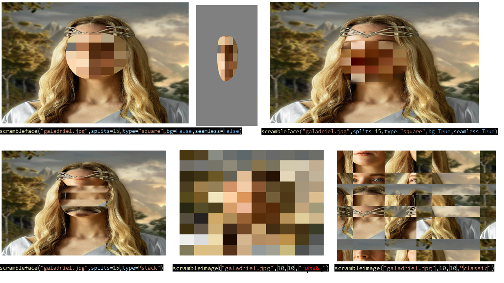

 # Scramblery
[](https://pepy.tech/project/scramblery)
[](https://badge.fury.io/py/scramblery)
[](https://github.com/altunenes/scramblery/actions/workflows/jekyll.yml)
[](https://ci.appveyor.com/project/altunenes/scramblery)
[](https://zenodo.org/badge/latestdoi/449034134)


A simple tool to scramble your images or only faces from images or videos. You can find the online demo in javascript [here](https://altunenes.github.io/scramblery/scramblerydemo.html). For more information, please visit the [documentation](https://altunenes.github.io/scramblery/).


#### Purpose of Package
 The purpose of this package is the creating scrambled images from images or videos. User can either scramble the whole image or only facial area.
 This is very useful tool in psychology experiments especially if you are working with faces. With a for loop you can scramble all the images in a folder and create a new folder with scrambled images. It was very long process to scramble images manually in the past and I feel like this package can be useful for many people. Hope this package will be useful for your research.

#### Motivation

- Image scrambling is important in psychology experiments because it allows researchers to control the content and structure of visual stimuli, while removing or altering specific features or patterns that might influence participants' perception or response.

- By scrambling an image, researchers can create a version of the image that preserves the overall luminance, contrast, and spatial layout, but that removes or distorts specific features or patterns that might be relevant for the experiment. For example, researchers might scramble an image of a face to remove the facial features, while preserving the overall brightness and contrast, or they might scramble an image of a scene to remove the objects, while preserving the spatial layout and color.
  
- It allows researchers to control for potential confounds and biases that might arise from the content of the stimuli. By removing or distorting specific features or patterns, researchers can create stimuli that are less predictable and less likely to elicit specific responses from participants. This can help researchers to isolate the effects of the manipulated variables, and to reduce the influence of confounding factors that might interfere with the interpretation of the results.

#### **Features**
- Scramble whole image with desired degree of scrambling (pixel values or pixel coordinates)
- Scramble only facial area with desired degree of scrambling (pixel values or pixel coordinates)
- Scramble only facial area in a video (useful for dynmaic stimuli) with desired degree of scrambling

#### Installation
- The package can be found in pypi. To install the package, run the following command in the terminal:
- `pip install scramblery`
#### Author

  -  Main Maintainer: [Enes ALTUN]


#### Usage
After installing the package, you can import the package as follows:
- `from scramblery import scramblery`
Then use the functions as follows to scramble images. I added some examples below.

  

  


Code example:
```python
from scramblery import scramblery
scramblery.scrambleimage("Lena.png", x_block=10, y_block=10, scramble_type='classic',seed=None,write=True)
#note: seed is optional, none means random seed
```
If you want to scramble images in a folder, check the API section here for an example: [API](https://altunenes.github.io/scramblery/userguide/).


#### Javascript Demo

Update:
Also, with the same paradigm, I have created an animated version of scramblery. It's shuffling pixel values and coordinates in a given ratio then it's arranging them back in the original order. You can find the online demo in javascript [here](https://altunenes.github.io/scramblery/magic.html).

example (gif animation):


#### Another Application

In this version, scramble processing is infinitely applied to the image :) 

You can find the online demo in javascript [here](https://altunenes.github.io/scramblery/pixeldance.html)


### Contributon
 Any kind of contribution is welcome.
