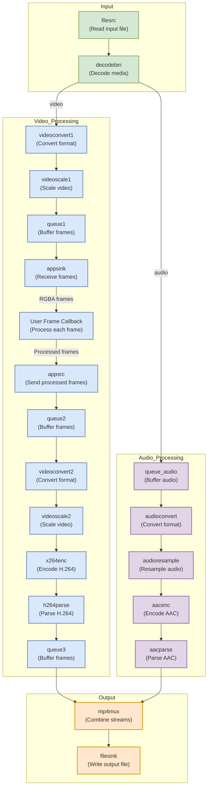

```mermaid
flowchart TB
    subgraph Input
        filesrc["filesrc\n(Read input file)"]
        decodebin["decodebin\n(Decode media)"]
    end

    subgraph Video_Processing
        direction TB
        videoconvert1["videoconvert1\n(Convert format)"]
        videoscale1["videoscale1\n(Scale video)"]
        queue1["queue1\n(Buffer frames)"]
        appsink["appsink\n(Receive frames)"]
        
        callback["User Frame Callback\n(Process each frame)"]
        
        appsrc["appsrc\n(Send processed frames)"]
        queue2["queue2\n(Buffer frames)"]
        videoconvert2["videoconvert2\n(Convert format)"]
        videoscale2["videoscale2\n(Scale video)"]
        x264enc["x264enc\n(Encode H.264)"]
        h264parse["h264parse\n(Parse H.264)"]
        queue3["queue3\n(Buffer frames)"]
    end

    subgraph Audio_Processing
        direction TB
        queue_audio["queue_audio\n(Buffer audio)"]
        audioconvert["audioconvert\n(Convert format)"]
        audioresample["audioresample\n(Resample audio)"]
        aacenc["aacenc\n(Encode AAC)"]
        aacparse["aacparse\n(Parse AAC)"]
    end

    subgraph Output
        muxer["mp4mux\n(Combine streams)"]
        filesink["filesink\n(Write output file)"]
    end

    %% Connections
    filesrc --> decodebin
    
    %% Video path
    decodebin -->|"video"| videoconvert1
    videoconvert1 --> videoscale1
    videoscale1 --> queue1
    queue1 --> appsink
    appsink -->|"RGBA frames"| callback
    callback -->|"Processed frames"| appsrc
    appsrc --> queue2
    queue2 --> videoconvert2
    videoconvert2 --> videoscale2
    videoscale2 --> x264enc
    x264enc --> h264parse
    h264parse --> queue3
    queue3 --> muxer
    
    %% Audio path
    decodebin -->|"audio"| queue_audio
    queue_audio --> audioconvert
    audioconvert --> audioresample
    audioresample --> aacenc
    aacenc --> aacparse
    aacparse --> muxer
    
    %% Output
    muxer --> filesink

    %% Styles
    classDef default fill:#f9f9f9,stroke:#333,stroke-width:2px;
    classDef input fill:#d5e8d4,stroke:#82b366;
    classDef process fill:#dae8fc,stroke:#6c8ebf;
    classDef output fill:#ffe6cc,stroke:#d79b00;
    classDef audio fill:#e1d5e7,stroke:#9673a6;
    
    class filesrc,decodebin input;
    class videoconvert1,videoscale1,queue1,appsink,callback,appsrc,queue2,videoconvert2,videoscale2,x264enc,h264parse,queue3 process;
    class queue_audio,audioconvert,audioresample,aacenc,aacparse audio;
    class muxer,filesink output;
```